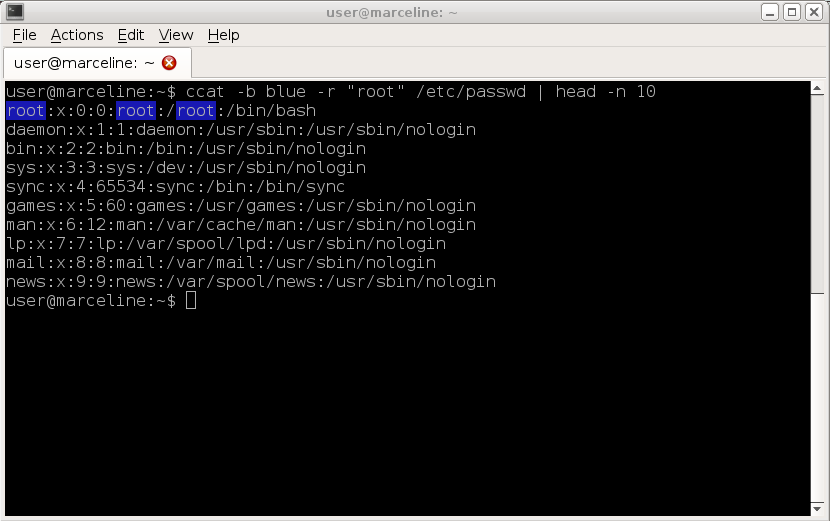
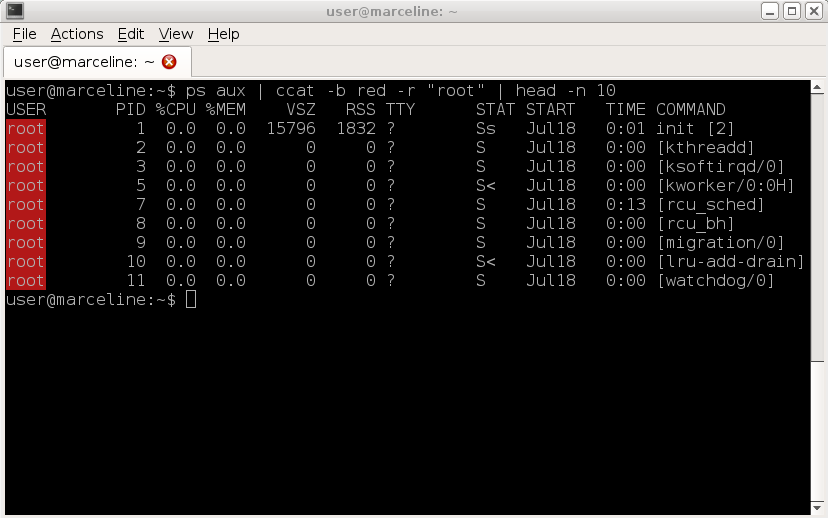
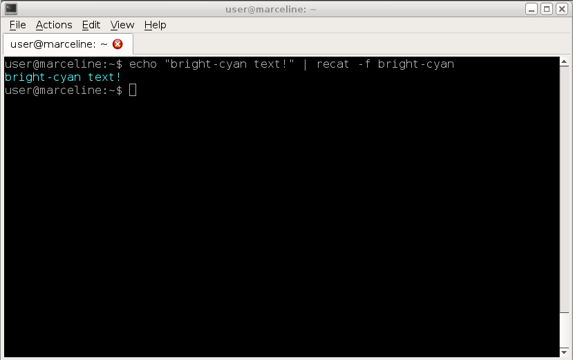
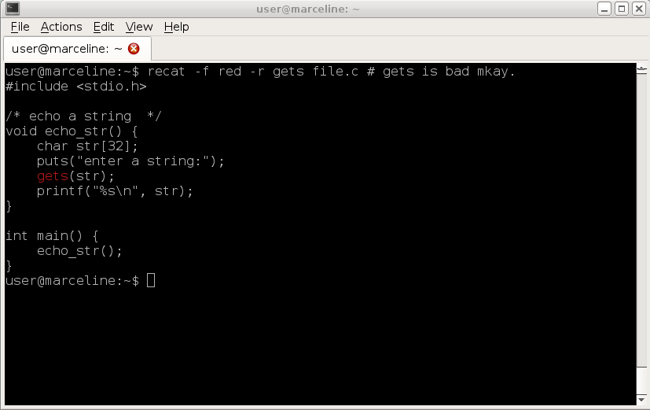

# recat
cat utillity with regular expressions and color.

### Help:
```bash
recat

--help             Print Help
--regex <str>      Pattern Matching
--fg    <str>      Set the foreground color
--bg    <str>      Set the background color

Examples:
  recat -b blue -r root /etc/passwd | head -n 10
  ps aux | recat -b red -r root | head -n 10
  echo "bright-cyan text!" | recat -f bright-cyan
  recat -f red -r gets file.c
```

### Example 1:

### Example 2

### Example 3

### Example 4

