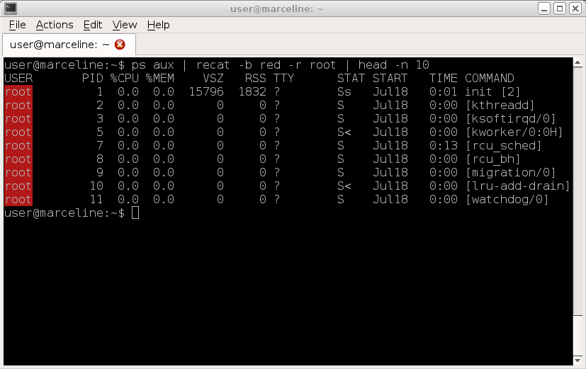

# recat
cat utillity with regular expressions and color.

### install
```bash
git clone https://github.com/lib64/recat
cd recat
make
sudo make install
```

### Help
```
recat - cat with regular expressions and color

Usage: recat [OPTION]... [FILE]...

With no FILE, read standard input.

--help   -h         Print Help
--regex  -r  <str>  Pattern Matching
--fg     -f  <str>  Set the foreground color
--bg     -b  <str>  Set the background color

Examples:
  recat -b blue -r root /etc/passwd | head -n 10
  ps aux | recat -b red -r root | head -n 10
  echo "bright-cyan text!" | recat -f bright-cyan
  recat -f red -r gets file.c
```

### Examples:




